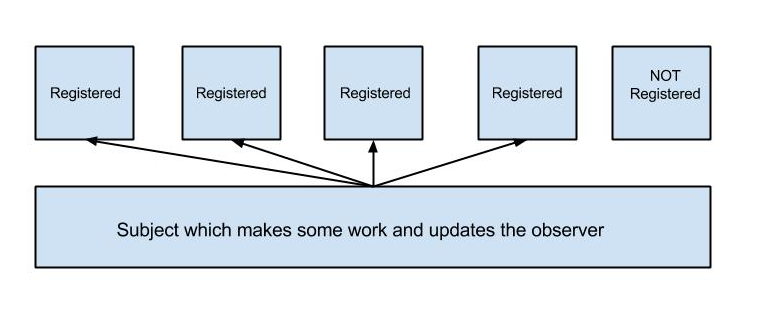

# 4. Android - MultiDownloader

This project is a little architecture with the purpose to show you how is possible to apply the Observer Pattern on android.

## Observer pattern
The observer pattern is used when you have objects where the state change of one object has to be notified to all object which are interested.

This is how, graphically, it works:



The following image is the uml representation of it:


## Let's build the model

The observer interface can be build with the following structure:

```java
public interface Observer {

	/**
	 * This method is used to tell to the generic observer
	 * that the file was completely downloaded
	 * @param dataUpdate
	 */
	void succesDownlod(GenericItemBean dataUpdate);

	/**
	 * This method is used to send to the observer the percent
	 * downloaded of the file
	 * @param dataUpdate
	 */
	void update(GenericItemBean dataUpdate);

	/**
	 * This tell to the observer that there was an error
	 * @param dataUpdate
	 */
	void error(GenericItemBean dataUpdate);

}
```
To realize the subject we'll extend a Service adding the following structure

```java

public abstract class AbstractControllerServ extends Service{

	/**
	 * List of the registered observers
	 */
	protected ArrayList<Observer> observers;

	/**
	 * Method to register the Ob
	 * @param ob
	 */
	public void registerObserver(Observer ob){
		this.observers.add(ob);
	}

	/**
	 * method to deregister
	 * @param ob
	 */
	public void deregidterObserver(Observer ob){
		if(this.observers.indexOf(ob) > 0)
			this.observers.remove(ob);
	}

	/**
	 * Method to tell to Observers which file was completed
	 * @param updateData
	 */
	public void succesDownlodDownloadObserver(GenericItemBean updateData){
		for (Observer ob : observers) {
			ob.succesDownlod(updateData);
		}
	}

	/**
	 * Method to send the current download progress of a specific item
	 * @param updateData
	 */
	public void updateObserver(GenericItemBean updateData){
		for (Observer ob : observers) {
			ob.update(updateData);
		}
	}

	/**
	 * Method used to the Observes that a download of an item was failed
	 * @param updateData
	 */
	public void errorObserver(GenericItemBean updateData){
		for (Observer ob : observers) {
			ob.error(updateData);
		}
	}

}


```

The Observers and the Subject are built, we now have to use these. To make this we have to provide the implementation of the Observer, in this case take for example an activity and which implements the Observer interface.
This is NOT sufficient to use the pattern, to provide an instance of our Subject we'll realize a simple mechanism to get the Subject, in other world we'll have to bind the service and use them as an android remote server.

```java

public abstract class AbObserverActivity extends FragmentActivity implements Observer{
	
	protected ControllerServ mService;
	private boolean mBound = false;
	
	@Override
	protected void onStart() {
		super.onStart();
		// Bind to ControllerServ
		Intent intent = new Intent(this, ControllerServ.class);
		bindService(intent, mConnection, Context.BIND_AUTO_CREATE);
	}

	@Override
	protected void onStop() {
		super.onStop();
		// Unbind from the service
		if (mBound) {
			unbindService(mConnection);
			mBound = false;
			rem();
		}
	}

	/**
	 * Register this Observer to the Subject
	 */
	protected void rec() {
		super.onResume();
		// segister Observer
		mService.registerObserver(this);
	}
	
	/**
	 * Deregister this Observer from the Subject
	 */
	protected void rem() {
		super.onPause();
		// deregister observer
		mService.deregidterObserver(this);
	}
	
	/** Defines callbacks for service binding, passed to bindService() */
	private ServiceConnection mConnection = new ServiceConnection() {

		@Override
		public void onServiceConnected(ComponentName className,
				IBinder service) {
			// We've bound to ControllerServ, cast the IBinder and get ControllerServ instance
			LocalBinder binder = (LocalBinder) service;
			mService = binder.getService();
			mBound = true;
			rec();
		}

		@Override
		public void onServiceDisconnected(ComponentName arg0) {
			mBound = false;
			rem();
		}
	};

}

```

With this approach in onStart method we'll get the instance of Subject and then we'll register the activity as Observer, in onStop method we'll deregister the Observer and unbind the service. In this way we've avoid to leak the activity (or some other component who want to register itself)

##under construction
